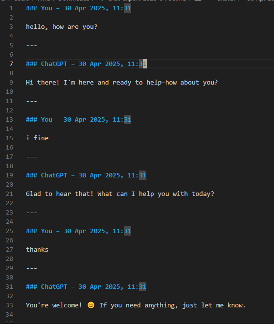
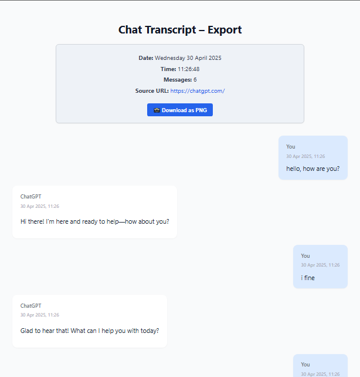

<h1 align="center">🛠 ChatGPT Tools</h1>

  📤 Export your ChatGPT chats to <strong>PDF/HTML Code</strong> & <strong>Markdown</strong> — flexibely, beautifully, and effortlessly.

  
  

---

  

  

---

## ✨ Features

- 📄 Export chats to **PDF/HTML Code**
- 📝 Export chats to **Markdown**
- ⚙️ Works directly via browser console — no installs

## 🔮 Coming Soon

- ⚡ Auto-download PDF on script paste
- 🖼️ Export chat as **PNG** (image snapshot)
- 📚 Batch export multiple chats
- ☁️ Cloud sync or shareable links
- 🎨 Theme customization (dark/light)
- 📌 Smart Highlighting / Important Point Detection
- 🧠 Prompt + Response Analyzer (AI-assisted)
- 📊 Insight Summary
- 🕰️ Timeline View / Conversation Playback
- 🔗 Auto-link External Sources
- 🧩 Chat Merging / Combine Sessions
- 📂 Export to Notion / Obsidian / Google Docs
- 🌿 Branch indicator

---

## 🚀 Getting Started

> **Note:** You’ll run a simple script in your browser — no setup needed.

1. 🔍 **Inspect** ChatGPT page  
   _Open DevTools (right-click > Inspect)_

2. 📋 **Copy the script**  
   _`export-md.js`, `export-pdf.js`_

3. 💻 **Paste in Console**  
   _Open Conole tab, paste, and Enter_

4. 📥 **Download your chat**  
   _Open print section (right-click > Print) save as`.pdf`_

---

## 🧠 Use Case

- Save research or prompts
- Share formatted conversations
- Archive important AI-assisted decisions

---

## 📄 License

MIT © [nhashih](https://github.com/nhashih)
